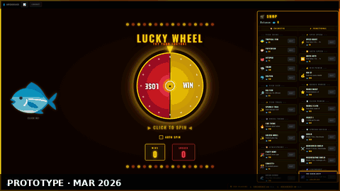

# Lucky Wheel 🎰



A casino-style spinning wheel game with a fish mascot, streaks and a fishing minigame, running on a Python/Flask backend with PostgreSQL persistence and user authentication.

📋 **[Patch Notes](https://github.com/Tom1tk/fishspin/wiki/Patch-Notes)** · 🏛 **[Season Museum](docs/SEASON_MUSEUM.md)**: every season, with a clip of each

## Overview

Lucky Wheel is a browser-based gambling wheel built with a Python/Flask backend and a React frontend. Spin the wheel, build streaks, fish for Surge, and race the rest of the server to the top of the weekly tide.

The current season is **Season 9 · Tides 🌊**. Instead of one long season that a single player can run away with, the race resets every week, and the top three each week take a medal that never resets.

All game state is stored server-side in PostgreSQL. Progress persists across devices and sessions, and client-side cheating is prevented.

## Features

### 🌊 Weekly Tides
Season 9 runs in weekly **tides**: 9.1, 9.2, 9.3 and so on. Every **Friday at 21:00 UK time** (`Europe/London`) the tide turns:
- **Wins, losses, streaks, Charts, Surge and 🪙 stake chips reset.** Everyone starts the new tide level.
- The **top three** are posted in chat, saved to the Hall of Fame and awarded a medal.
- A new **community goal** starts.

**What carries over** from tide to tide: cosmetics (owned and equipped), your Encyclopaedia and record weights, medals, chat and your account.

The **tide banner** at the top of the screen shows the current tide, a countdown to the next turn and last tide's podium. Tap it to open the **Hall of Fame**.

### 🏛 Hall of Fame & Medals
Finish a tide in the top three to earn 🥇 🥈 🥉. Medals are the long chase of the season. The Hall of Fame shows the medal table and the podium of every past tide.

### Core Gameplay
- **Spinning wheel**: WIN or LOSE, styled as a neon casino wheel with smooth CSS rotation
- **Win/loss counter**: persisted in PostgreSQL across sessions and devices
- **Streak bonus**: 3+ consecutive wins or losses pays a scaling bonus. ×2 per step up to streak 15, then cubic and linear growth, with a hard cap at streak 150 (113,096 raw bonus)
- **Streak panel**: appears in the left sidebar only when a streak is active (fire emoji for wins, skull for losses)
- **Stats popup**: the 📊 button shows total spins, wins, losses, win rate, fish bucks, fastest catch, and your **Season History**
- **Leaderboard**: top 10 players of the current tide, ranked by wins
- **🎲 Dice**: roll two dice (three with Third Die) to add the sum to a win streak of 3+. Snake eyes halves your streak, double sixes doubles it; with three dice, triple 1s ÷3 and triple 6s ×3. One charge to start, recharging every 10 minutes. Riptide's Loaded Dice holds more

### 🧭 Charts
The functional shop is gone. Gear comes from **Charts**: three talent trees, and not enough points for all of them.
- You start each tide with **1 point** and get **one free point every day** (days start at 21:00 UK time, in step with the tide).
- **Level up** to get points sooner. Each level costs wins: 1,000 for the first, then ×6 each time (6k, 36k, 216k, …).
- The cap is **14 points**: one full tree and a splash of another, never all three. Levels reset when the tide turns.
- Higher rows need points in that tree first (row 2 needs 2, row 3 needs 4, the keystone needs 6), and you can hold **one keystone**.
- Adding points is always free. A **re-chart** (taking points back) is allowed once a day.

| Tree | Talent | Ranks | Effect |
|------|--------|-------|--------|
| 🌊 **Swell**: ride the streak | 🫧 Undertow | 3 | Streak bonuses ×2 / ×4 / ×8 |
| | 📈 Rising Tide | 2 | Every win pays ×2 / ×4 |
| | ⚓ Steady Keel | 1 | Sometimes a loss only knocks your streak back one |
| | 🍀 Fortune Charm | 1 | Streak bonuses sometimes pay +25% |
| | 🔔 Echo | 1 | Wins sometimes pay twice |
| | 🛡️ Breakwater | 1 | Blocks one loss, recharges after 25 wins |
| | 🌕 **Spring Tide** (keystone) | 1 | Streak bonuses ×2 again, but you can't stake or roll dice |
| 🌀 **Riptide**: bet the tide | 🪙 Open Water | 1 | Stake up to 30% of your wins. Each staked spin costs 1 🪙 |
| | 🎲 Loaded Dice | 3 | Hold 2 / 3 / 4 dice charges |
| | 🔱 Deep Water | 2 | Stake up to 35% / 40% |
| | 💎 Treasure | 1 | 1% of wins are jackpots: ×25, or ×5 on a staked spin |
| | 🛟 Safety Line | 1 | Staked losses refund a little; arm insurance |
| | 🎯 Third Die | 1 | Roll three dice |
| | ⚖️ Double or Nothing | 1 | Re-stake your last win in one go |
| | 🌪️ **Rogue Wave** (keystone) | 1 | Dice come back twice as fast and stack two higher, but no Surge |
| 🎣 **Angler**: read the water | 🐚 Rich Waters | 3 | Surge spins pay ×25 / ×50 / ×100 (base ×5) |
| | 🪱 Better Bait | 2 | Faster bites, bigger catches, +25% / +50% Surge |
| | ⛵ Deckhand | 2 | Auto-fish while you're away; catches more often |
| | ✋ Steady Hands | 3 | Wider reel bar; bar moves 50% faster; a slipping fish escapes 25% slower |
| | 🔁 Auto-Cast | 1 | Recast automatically |
| | 🧓 Old Salt | 1 | Auto-fish catches rares, and more often |
| | 🐋 **Deep Sea** (keystone) | 1 | Junk and commons stop biting, rares and legendaries bite three times as often, and bites take longer |

Some talents need another first: Deep Water, Safety Line and Double or Nothing need Open Water; Old Salt needs Deckhand.

### 🎣 Fishing Is a Fight
- Click **🎣 CAST** to drop your line. When the fish bites, tap to **hook** it.
- Then keep the 🐟 inside your **green reel bar**. Hold (mouse, touch or Space) to push the bar right; let go and it drifts back. The catch meter fills while the fish is in the bar and drains while it isn't. If it empties, the fish gets away.
- Rarer fish swim faster, dart more often and take longer to land.
- A cleaner fight lands a **heavier fish**, and heavier fish are worth more 🐟. Your heaviest catch of each species is saved as a **record** that never resets.
- Your first catch of each day pays ×5.
- **Auto-fish** (Angler: Deckhand) catches commons and uncommons every few seconds, rares with Old Salt, never legendaries. It keeps fishing while you're away.
- All timing is server-authoritative: the bite, the fight and the catch are validated server-side.

### 🐠 46 Species
The **Fish Encyclopaedia** (📖) tracks **46** species across junk, common, uncommon, rare and legendary. Many only bite at **dawn, day, dusk or night** (UK time), at **high or low tide** (the tide turns every 6¼ hours), or are **migrants** that visit for a week at a time. The Encyclopaedia shows the current tide, what's **biting now**, a hint for every fish and your record weights.

### 🌊 Surge
Fishing powers the wheel. Every catch charges **Surge spins**: more for rarer and heavier fish, a quarter as much from auto-fishing. While you have Surge, each spin uses one and multiplies its wins: ×5 for everyone, up to ×100 with Rich Waters. The chip under your score shows how many Surge spins you have left and what they pay.

### 🪙 Stake Chips & the Stake Panel
With **Open Water** you can stake part of your wins on a spin. The stake panel raises your stake in 5% steps (30% cap, 40% with Deep Water) and shows what you'd win or lose before you spin.
- **Stake escrow**: the stake is debited up front and held at risk. Win it back plus your payout, or lose it.
- **Stake chips**: claim **3 free chips a day**. Each staked spin costs one chip. Community goals pay chips too.
- **Safety Line**: a staked loss refunds 25% of the stake, and you can **arm insurance** to cap a spin's loss and refund the stake.
- **Double or Nothing**: put your entire last win on the line. All-or-nothing: no insurance or safety net applies.

### Wheel Modes
Switch the wheel's odds profile at will. **Steady** and **Volatile** are always available; one more mode rotates weekly, turning with the tide on Friday at 21:00.

| Mode | Win % | Loss % | Jackpot % | Jackpot × | Notes |
|------|-------|--------|-----------|-----------|-------|
| Steady (default) | 70% | 28% | 2% | 25× | Small wins, rare losses |
| Volatile | 45% | 50% | 5% | 50× | High variance, double jackpot payout |
| Inverted *(rotates)* | 35% | 60% | 5% | 25× | Losses become small wins; loss streaks still build bonus |
| Gravity *(rotates)* | 55% | 40% | 5% | 25× | Outcomes drift toward the last result |
| Long Shot *(rotates)* | 20% | 60% | 20% | 10× | Most spins lose; jackpots hit often but pay less |

The rotating slot cycles Inverted → Gravity → Long Shot by week.

### Daily Bounties
Three bounties a day, the same three all day, resetting at midnight UTC. They are streaks and fishing only, so every build can finish them: reach a 10-spin win streak, catch 10 fish, land 5 fish in a fight, land a rare or legendary, land a trophy-sized fish. Each one pays **Surge**: 100, 200 and 300 spins.

### Community Goals
One server-wide goal per tide: catch fish, land jackpots, or wager wins. Everyone's progress counts toward one shared target, with a per-player cap so no one can solo it. Completing it pays every contributor 10 🪙 chips and lifts everyone's win chance to 55% for a week.

### 🔁 Auto-Spin
- **Free for everyone.** Tick auto-spin and the wheel spins every 3 seconds.
- It **keeps going when you close the tab or log out**. Come back within 24 hours and your missed spins are played out, with a **"While you were away"** card showing the time, spins and wins (and fish, with auto-fish).
- Manual spinning is locked while auto-spin runs.

### 🌅 A Calmer Start
New players don't get every panel at once. **Fishing** opens at 10 spins (or your first catch), **Bounties** at 25, **Dice** at your first 3-streak, and the **Community Goal** at 50. Once a panel opens it stays open, even after the tide turns.

### 🧹 Retired in Season 9
To keep the weekly race fair, systems built for endless seasons are retired: **Prestige**, **Loadouts**, the **Singularity** and the **Aquarium** (their API routes return `410 Gone`). Classes and the functional shop are gone too: gear comes from Charts. The leaderboard ranks by wins alone.

### Authentication
- Register with a username (3–32 alphanumeric) and password (6+ chars)
- One account per device (enforced via a long-lived `device_id` cookie; multiple users on the same IP are fine)
- Strict single-session enforcement — logging in on a new device boots the previous session
- 30-day persistent login sessions (signed HTTP-only cookies)
- Brute-force protection: escalating lockouts after 5/10/20 failed attempts per username (1min/5min/1hr)
- All login and registration attempts are logged with IP, normalised username, User-Agent, and rejection reason

### Chat
A persistent chat channel (bottom-right panel, resizable) where players can talk, alongside automatic announcements for big wins, double-down wins, new players, community goal milestones and each tide's podium.

### Rising Fire Effect
- A full-viewport canvas fire effect rises behind all game UI, scaling with win streak intensity
- **Mix** mode (default) — embers and a cellular automaton inferno layered with additive blending
- Embers appear from streak 3; inferno ignites from streak 10; screen fills around streak 30
- Intensity lerps smoothly — wins cause the fire to grow, a loss makes it fall gradually rather than cutting out
- Suppressed automatically in Low-Spec Mode and when OS `prefers-reduced-motion` is set

### Mobile Support
- Fully playable on phones and tablets (≤ 768 px breakpoint); the desktop layout is unchanged
- **Bottom toolbar**: Shop 🏪, Leaderboard 🏆, Fishing 🎣 (once unlocked), Chat 💬, Backpack 🎒 and Stats 📊
- **Backpack drawer**: stake chips, Bounties and the Community Goal in one scrollable column
- **Tap-to-dismiss backdrop**: tapping outside any open panel closes it

### Performance
- **Low-Spec Mode** (⚡ button in the top bar) — disables infinite CSS animations, GPU-heavy drop-shadows, confetti, fish aura, and fire effect; respects OS `prefers-reduced-motion`
- Preference is saved per user in the database and synced across devices

### Anti-Cheat
- All game logic runs server-side; clients cannot submit win/loss outcomes, fish catches, or spin results
- Stakes, chips and Chart allocations are re-validated server-side rather than trusting client-supplied amounts
- Replay strings are HMAC-signed so a hand-crafted string can't impersonate a real win
- Only one tab plays at a time: a second tab is paused and offers **Play here** to move over
- Rate limiter keys on **user account** rather than IP (prevents shared-network collisions)

---

## Shop

In Season 9 the shop sells **cosmetics only**, paid for in **losses**. Gameplay gear comes from Charts. The shop shows your Chart at a glance; tap it to open the full Charts. Cosmetics are kept forever, through every tide.

### Currencies
- **Wins**: your score for the tide, and what Chart levels cost.
- **Losses**: spent on cosmetics (skins, trails, themes, backgrounds).
- **Fish Bucks 🐟**: earned from fishing.
- **Surge spins 🌊**: earned from fishing and bounties; each one multiplies a spin's wins.
- **Stake chips 🪙**: 3 free a day, plus community goals; spent on staked spins.

### Fish Skins (Costs Losses)
| Skin | Cost | Emoji |
|------|------|-------|
| Tropical Fish | 25 | 🐠 |
| Pufferfish | 50 | 🐡 |
| Octopus | 75 | 🐙 |
| Shark | 100 | 🦈 |
| Dolphin | 150 | 🐬 |
| Squid | 200 | 🦑 |
| Turtle | 350 | 🐢 |
| Crab | 600 | 🦀 |
| Lobster | 1,000 | 🦞 |
| Whale | 2,000 | 🐳 |
| Seal | 3,500 | 🦭 |
| Shrimp | 6,000 | 🦐 |
| Coral | 10,000 | 🪸 |
| Mermaid | 17,500 | 🧜 |
| Crocodile | 30,000 | 🐊 |
| Rocket | 50,000 | 🚀 |
| Comet | 85,000 | ☄️ |
| Saturn | 145,000 | 🪐 |
| Alien | 250,000 | 👽 |
| UFO | 425,000 | 🛸 |
| Lucky Dice | 600,000 | 🎲 |
| Joker | 850,000 | 🃏 |
| Diamond | 1,200,000 | 💎 |
| Poker | 1,700,000 | ♠️ |
| Slot Machine | 2,400,000 | 🎰 |

Each skin has custom idle/win/loss speech. Buy and equip to change the fish.

### Fish Trail (Costs Losses)
Visual trail effect on the fish. Trail and streak aura effects coexist independently.
| Tier | Cost | Effect |
|------|------|--------|
| Sparkle Trail | 125 | ✨ Gold shimmer |
| Fire Trail | 500 | 🔥 Flame glow |
| Rainbow Trail | 2,000 | 🌈 Rainbow hue |
| Frost Trail | 7,000 | ❄️ Ice crystal aura |
| Thunder Trail | 22,000 | ⚡ Electric sparks |
| Galaxy Trail | 70,000 | 🌌 Cosmic swirl |

### Wheel Theme (Costs Losses)
Changes the canvas colour palette of the wheel. Two independent chains — own and switch between either freely.
| Theme | Cost | Look |
|-------|------|------|
| Fire Theme | 250 | 🔥 Red/orange |
| Ice Theme | 1,000 | ❄️ Blue/cyan |
| Neon Theme | 4,000 | 💜 Purple/neon |
| Void Theme | 12,000 | 🌑 Deep void |
| Gold Theme | 40,000 | ✨ Pure gold |
| Tidal Theme | 250 | 🌊 Cool blue/teal, wave animation |
| Ember Theme | 1,000 | 🔥 Warm orange, spark animation |
| Frost Theme | 4,000 | ❄️ Ice-crystal palette, crack animation |
| Aurora Theme | 12,000 | 🌌 Shifting greens/purples, northern lights |
| Vintage Theme | 40,000 | 📼 Retro sepia tones |
| Golden Wheel | 300 | ✨ Radiant glow ring (independent of theme) |

### Fishing Panel Size (Costs 1 Loss, accessibility)
Resizes the fishing panel. Priced at 1 loss each as an accessibility option, not a progression item.

| Tier | Cost | Panel Size |
|------|------|-----------|
| Compact | 1 | 50% |
| Big Panel | 1 | 130% |
| Giant Panel | 1 | 160% |
| Colossal | 1 | 200% |

### Atmosphere (Costs Losses)

#### Background Theme
Ocean Casino (an animated seabed, static in Low-Spec Mode) is the free default. Buying and equipping another background overrides it.

| Theme | Cost | Look |
|-------|------|------|
| Royal Casino | 400 | Rich purple |
| Inferno Casino | 1,600 | Blazing red |
| Forest | 5,000 | 🌲 Lush green |
| Abyss | 15,000 | 🌊 Deep dark ocean |
| Cosmic | 50,000 | 🌌 Space nebula |

#### Page Theme
Each season's page theme is granted to everyone automatically; older ones can be bought.

| Theme | Cost | Look |
|-------|------|------|
| Season 1 | 1,000 | Classic gold & orange |
| Season 2 | 1,000 | Green & red |
| Season 3 | 1,000 | Purple & orange |
| Season 4 | 1,000 | Deep violet |
| Season 5 | 1,000 | Bioluminescent cyan & coral |
| Season 6 🌙 | 1,000 | Night ocean: deep indigo & violet |
| Season 7 | 1,000 | Sepia-tinted |
| Season 8 🎰 | 1,000 | Casino floor |
| Season 9 🌊 | 1,000 | Tides: current season default (auto-granted to all players) |

#### Confetti
| Tier | Cost | Count |
|------|------|-------|
| Confetti+ | 75 | ×2 |
| Confetti++ | 300 | ×5 |
| Confetti MAX | 1,200 | ×15 |
| Party Mode | 150 | Confetti on every result |

---

## Running Locally

### Requirements
- Python 3.8+
- PostgreSQL 14+
- Node.js (for the one-time JSX build step)

### 1. Install Python dependencies

```bash
pip install -r requirements.txt
```

### 2. Set up PostgreSQL

```bash
# Create DB user and database
sudo -u postgres psql -c "CREATE USER wheelapp WITH PASSWORD '<your-password>';"
sudo -u postgres psql -c "CREATE DATABASE wheeldb OWNER wheelapp;"
```

Then apply the baseline schema and run migrations:

```bash
PGPASSWORD='<your-password>' psql -U wheelapp -d wheeldb -h localhost -f schema.sql
DATABASE_URL="postgresql://wheelapp:<your-password>@localhost/wheeldb" python migrate.py
```

### 3. Configure environment

Both variables are **required** — the server will refuse to start without them.

```bash
export DATABASE_URL="postgresql://wheelapp:<your-password>@localhost/wheeldb"
export WHEEL_SECRET_KEY="$(python -c 'import secrets; print(secrets.token_hex(32))')"
export PORT=5000   # optional, defaults to 5000
```

For convenience, copy `.env.example` to `.env` — `python-dotenv` will load it automatically.

### 4. Build the frontend

The JSX source must be transpiled once (and again after any `app.jsx` changes):

```bash
npx babel static/app.jsx -o static/app.js
```

Presets are loaded from `babel.config.json` in the repo root, so no
`--presets` flag is required.

### 5. Start the server

**Production (recommended):**
```bash
gunicorn -c gunicorn.conf.py server:app
```

**Development:**
```bash
python server.py
```

Open [http://localhost:5000](http://localhost:5000) in your browser. You'll be prompted to register or log in.

---

## Staging Environment

A separate staging environment runs on port 5001 against a `wheeldb_staging` database, using a git worktree on the `staging` branch.

```
/home/user/wheel-app/           ← master (production, port 5000, wheeldb)
/home/user/wheel-app-staging/   ← staging (port 5001, wheeldb_staging)
```

**Start staging dev server:**
```bash
cd /home/user/wheel-app-staging && PORT=5001 python server.py
```

**Promote to production:**
```bash
cd /home/user/wheel-app && ./deploy.sh
```

`deploy.sh` merges staging → master, applies pending migrations, rebuilds the frontend, and reloads gunicorn.

---

## Tide Rollover

The tide turns automatically every Friday at 21:00 UK time, driven by a systemd timer (`deploy/wheel-rollover.timer` → `deploy/wheel-rollover.service`) that runs `bin/rollover.sh`:

1. `bin/advance_tide.py --check-only`: is a tide due? If not, exit quietly.
2. Clone the live database (`bin/clone-prod-to.sh`) and rehearse the rollover on the clone, then verify it with `bin/post_rollover_check.py`.
3. Back up the live database.
4. Advance the live tide (`seasons.advance_season`) and verify it again, including the live `/api/season` and `/api/hall-of-fame`.

The script holds a lock so two runs can't overlap. On any failure it stops, leaves a `ROLLOVER_FAILED` marker in the app directory, and keeps the rehearsal database for inspection. `APP_DIR`, `PROD_DB`, `REHEARSAL_DB`, `LIVE_URL` and `BACKUP_CMD` can be overridden to point it at staging.

---

## Database Migrations

Schema changes are managed with numbered SQL files and a lightweight migration runner.

```bash
python migrate.py              # apply pending migrations
python migrate.py --status     # show applied / pending migrations
python migrate.py --dry-run    # preview without executing
```

Migration files live in `migrations/NNN_description.sql`. Applied versions are tracked in the `schema_migrations` table in each database.

---

## Running Tests

The test suite uses `pytest`. Run it via the Makefile target or directly:

```bash
make test                  # equivalent to: python3 -m pytest -q
python3 -m pytest -q       # run from the repo root
python3 -m pytest tests/test_models.py -q   # single file
```

**Prerequisites:** a reachable PostgreSQL instance is required for the
DB-backed tests. The test suite now runs against `wheeldb_test` (a
clone of the production schema), NOT the production `wheeldb` —
T246's conftest safety check refuses to run if `DATABASE_URL` points
at the prod database. Set up the test DB once:

```bash
make test-db-reset   # drops, recreates, and migrates wheeldb_test
make test            # runs the suite
```

The connection string is read from the `DATABASE_URL` environment
variable — set it in your shell or in `.env`. The `make test` target
auto-rewrites a `wheeldb` URL to `wheeldb_test` so a developer's
local `.env` works as-is. (T234 moves the staging credentials out
of the test files into `.env`, so a missing
`DATABASE_URL` will fail with a clear error rather than silently using a
baked-in credential). The safety check also refuses to run if
`DATABASE_URL` points at the production `wheeldb` (it must be
`wheeldb_test` or `wheeldb_staging`).

The unit tests in `tests/test_models.py` and
`tests/test_format_wins_python.py` are pure and need no DB.

---

## Project Structure

```
wheel-app/
├── server.py          # Thin entry point: create_app() → gunicorn target
├── app.py             # Flask app factory: config, extensions, blueprints, error handlers
├── auth.py            # Blueprint: /api/me, /api/register, /api/login, /api/logout
├── game.py            # Blueprint: state, spin, tick, auto-spin, dice, charts, fishing,
│                      #            shop, wager, bounties, community goal, hall of fame,
│                      #            leaderboard, stats, season, health
├── season_config.py   # Current season: name, number, page theme, rollover day/time
├── seasons.py         # Tide labels, next rollover time, advance_season()
├── talents.py         # Charts: the three trees, points, level cost, Surge rules
├── fish.py            # Cast, bite, fight and land; auto-fish
├── fish_catalog.py    # The 46 species: rarity, time-of-day, tide and migrant windows, weights
├── dice.py            # Dice charges, recharge and rolls
├── shop.py            # Buying and equipping cosmetics
├── db.py              # psycopg2 ThreadedConnectionPool + db_connection() context manager
├── models.py          # FISH_SKINS, SHOP_ITEMS, streak bonus and other game constants
├── wagers.py          # Stake validation, escrow risk calculation
├── wheel_modes.py     # Wheel mode definitions + weekly rotation
├── bounties.py        # Daily bounty selection, progress, Surge rewards
├── community_goals.py # Per-tide community goal lifecycle
├── chat.py            # Blueprint: /api/chat, system message posting
├── chat_triggers.py   # System announcement text (big wins, tide podium, goal milestones)
├── security.py        # check_lockout(), record_attempt(), clear_attempts(), require_json()
├── extensions.py      # Flask-Limiter and Flask-Login instances
├── migrate.py         # SQL migration runner (apply / status / dry-run)
├── deploy.sh          # Production deploy: merge staging → migrate → build → reload
├── gunicorn.conf.py   # Gunicorn config: 4 gthread workers × 4 threads, PORT from env
├── schema.sql         # PostgreSQL baseline schema
├── migrations/        # Numbered SQL migration files (NNN_description.sql)
├── bin/               # Tide rollover: rollover.sh, advance_tide.py, post_rollover_check.py,
│                      #   clone-prod-to.sh
├── deploy/            # systemd units for the weekly rollover timer
├── requirements.txt   # Python dependencies
├── .env.example       # Required environment variable template
└── static/
    ├── index.html     # Slim HTML shell
    ├── app.jsx        # React source (edit this)
    ├── app.js         # Compiled output (generated by Babel — do not edit directly)
    └── styles.css     # All CSS
```

---

## API Reference

All game endpoints require authentication (session cookie). POST endpoints require `Content-Type: application/json`. Routes without a listed limit share the default of 200/min.

### Auth
| Endpoint | Method | Rate Limit | Description |
|----------|--------|------------|-------------|
| `/api/me` | GET | — | Returns `{username}` or `{username: null}` |
| `/api/register` | POST | 5/hr | Create account |
| `/api/login` | POST | 10/min | Authenticate |
| `/api/logout` | POST | — | Clear session |

### Game
| Endpoint | Method | Rate Limit | Description |
|----------|--------|------------|-------------|
| `/api/health` | GET | — | DB connectivity check → `{"status":"ok"}` or 503 (no login needed) |
| `/api/state` | GET | — | Full game state |
| `/api/season` | GET | 60/min | Current season and tide label |
| `/api/settings` | POST | — | Persist user preferences (`low_spec_mode`) |
| `/api/spin` | POST | 10/sec | Server determines outcome, updates DB. Body: `{stake, tab_id}` |
| `/api/tab/heartbeat` | POST | 30/min | Claim or keep the playing tab. Body: `{tab_id, takeover}` |
| `/api/auto-spin/start` | POST | — | Start auto-spin |
| `/api/auto-spin/stop` | POST | — | Stop auto-spin |
| `/api/tick` | POST | 30/min | Play out due auto-spins; summarises a catch-up after time away |
| `/api/roll-dice` | POST | 3/sec | Roll dice onto a 3+ win streak |
| `/api/charts` | GET / POST | POST 10/sec | Get your Chart / save it. Body: `{alloc}` |
| `/api/charts/level-up` | POST | 10/sec | Buy a Chart point with wins |
| `/api/cast` | POST | 5/sec | Cast the line |
| `/api/bite-poll` | POST | 8/sec | Check for a bite |
| `/api/reel` | POST | 5/sec | Hook the fish and start the fight |
| `/api/land` | POST | 5/sec | Finish the fight. Body: `{landed, quality}` |
| `/api/fish-catalog` | GET | — | All species, what's biting now, your records |
| `/api/auto-fish-tick` | POST | 1/5sec | One automated catch (needs Deckhand) |
| `/api/auto-fish-enabled` | POST | 10/min | Toggle auto-fish. Body: `{enabled}` |
| `/api/buy` | POST | — | Buy a cosmetic. Body: `{item_id}` |
| `/api/equip` | POST | — | Equip a fish skin. Body: `{fish_id}` |
| `/api/equip-cosmetic` | POST | — | Toggle a cosmetic on/off. Body: `{item_id}` |
| `/api/wager/stake` | POST | — | Set your stake. Body: `{stake}` |
| `/api/wager/double-down` | POST | — | Arm Double or Nothing for the next spin |
| `/api/wager/double-down/cancel` | POST | — | Disarm it |
| `/api/insurance/arm` | POST | — | Arm insurance for the next spin |
| `/api/insurance/cancel` | POST | — | Disarm it |
| `/api/insurance/claim-free` | POST | — | Claim today's 3 stake chips (409 if already claimed) |
| `/api/wheel-mode` | POST | — | Set active wheel mode. Body: `{mode}` |
| `/api/bounties` | GET | — | Today's 3 bounties with progress |
| `/api/bounties/claim` | POST | — | Claim a completed bounty's Surge. Body: `{bounty_id}` |
| `/api/community-goal` | GET | — | This tide's goal, progress and your contribution |
| `/api/hall-of-fame` | GET | 30/min | Every past tide's podium and the medal table |
| `/api/leaderboard` | GET | 30/min | Top 10 players of the current tide |
| `/api/stats` | GET | — | Personal stats, including Season History |
| `/api/patch-notes` | GET | 20/min | Patch notes |
| `/api/chat` | GET / POST | GET 30/min, POST 1/sec | Read / post chat messages |
| `/api/admin/advance-season` | POST | — | Admin only (`X-Admin-Secret` header) |

**Retired in Season 9** (return `410 Gone`): `/api/prestige`, `/api/singularity`, `/api/singularity/contribute`, `/api/loadout`, `/api/loadout/apply`, `/api/aquarium`. `/api/wins-exchange` returns 403.

`/api/spin` response (abridged; see `_RESPONSE_KEYS` in `game.py` for the full set):
```json
{
  "result": "win",
  "wins_delta": 40,
  "losses_delta": 0,
  "streak": 4,
  "bonus_earned": 4,
  "effective_win_mult": 5,
  "jackpot_hit": false,
  "echo_triggered": false,
  "stake": 0,
  "insurance_tokens": 3,
  "active_wheel_mode": "steady",
  "surge_spins": 41,
  "surge_used": true,
  "message": "..."
}
```

`wins_delta` and `losses_delta` are the change from this spin (net of any stake escrow). The client adds these to its local state to avoid race conditions.

---

## Frontend Architecture

The frontend is a pre-compiled React app. Edit `static/app.jsx` and run the Babel build step to update `static/app.js`. Key components:

| Component | Purpose |
|-----------|---------|
| `App` | Root: checks `/api/me`, renders `AuthPage` or `GameApp` |
| `AuthPage` | Login/register form with error handling |
| `GameApp` | Main game: wheel, fish, panels, all API calls |
| `TideBanner` | Current tide, countdown to the turn, last tide's podium; opens the Hall of Fame |
| `HallOfFamePanel` | Medal table and every past tide's podium |
| `TidesBackground` | The Season 9 animated sea background |
| `ChartsPanel` | The three Chart trees: spend, level up, re-chart |
| `ChartStrip` | Your Chart at a glance, inside the shop |
| `FishingPanel` | Cast, bite, and the reel-bar fight; Auto-Cast/Auto-Fish toggles |
| `FishEncyclopedia` | All 46 species, what's biting now, hints and record weights |
| `StreakPanel` | Sidebar streak display |
| `DicePanel` | Dice charges and the roll button |
| `WagerPanel` | Stake panel, Double or Nothing and insurance |
| `FreeTokensPanel` | Claim today's stake chips |
| `BountiesPanel` / `CommunityGoalPanel` | Progress bars and claim buttons |
| `ShopPanel` | Cosmetics shop with the Chart strip; collapsible |
| `Leaderboard` | Top 10 players of the tide |
| `StatsPanel` | Personal stats modal (📊) |
| `PatchNotesPanel` | Patch notes and What's New |
| `FireEffect` | Full-viewport canvas fire behind the UI, scaled by win streak |
| `ChatPanel` | Resizable bottom-right chat panel |
| `GuardWheel` | Mini wheel overlay when Breakwater blocks a loss |
| `drawWheel` | Canvas rendering with theme support (default / fire / ice / neon / void / gold / tidal / ember / frost / aurora / vintage) |

**Mobile layout** is handled in CSS (`@media (max-width: 768px)`) and a small amount of React state (`isMobile`, `mobilePanel`) in `GameApp`. The same components are reused, positioned via CSS class toggles.

**Minimal localStorage**: game state lives in PostgreSQL, but UI preferences (low-spec mode, chat panel size/open state, patch-notes-seen, one-time hints) persist in `localStorage`.

---

## Tech Stack

- **Backend**: Python, Flask, flask-login, flask-limiter, bcrypt
- **Database**: PostgreSQL (psycopg2 with `ThreadedConnectionPool`)
- **WSGI**: Gunicorn (gthread workers)
- **Frontend**: React 18 (CDN UMD), pre-compiled JSX via Babel CLI, vanilla CSS
- **Auth**: Server-side sessions via signed HTTP-only cookies (SameSite=Lax)
